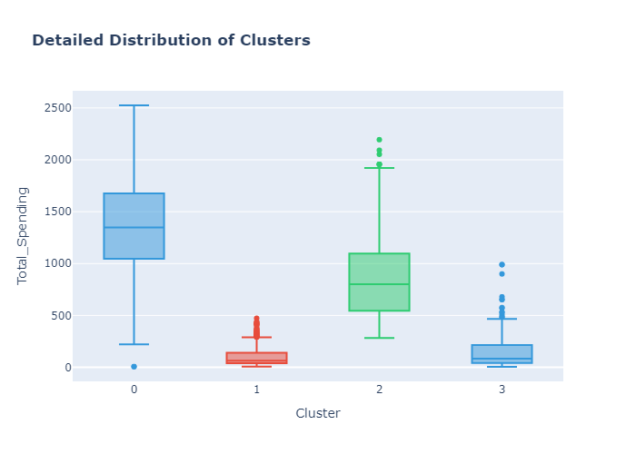

# 🛒 Customer Segmentation Analysis


<p align="center">
  
</p>

## 📌 Overview
A **machine learning pipeline** to segment customers into behavior-based groups using:
- **PCA** for dimensionality reduction  
- **K-Means/DBSCAN** clustering  
- **Business-driven labeling** for actionable insights  

**Use Case**: Optimize marketing strategies by identifying high-value customers, budget-conscious groups, and omnichannel shoppers.

---

## 🚀 Quick Start

### Installation
```bash
git clone https://github.com/yourusername/customer-segmentation.git
cd customer-segmentation
pip install -r requirements.txt